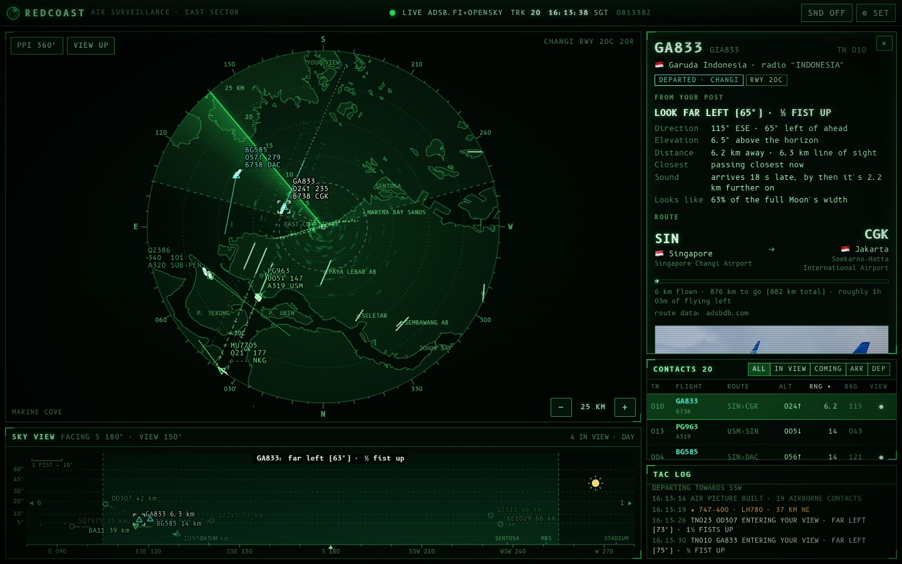
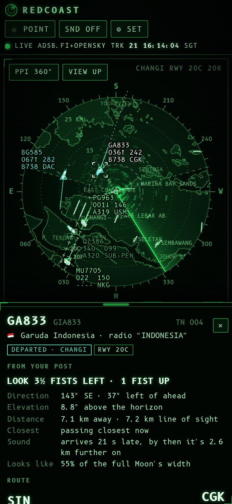

# RedCoast

A military-style air-surveillance scope for the planes you see from a balcony on Singapore's East Coast.
It shows live positions around Changi, what each aircraft is, where it's going, and exactly where to look.

**Live:** https://lproperty.github.io/RedCoast/





## What it does

- **Radar scope.** Phosphor-green PPI with a rotating sweep, afterglow returns, range rings, a bearing scale,
  the OpenStreetMap coastline, runways, and Changi's approach centrelines with nautical-mile ticks. Your view
  is at the top by default. **Sector** mode turns it into a forward-looking fan that uses every pixel for
  what's in front of you.
- **Contacts that move smoothly.** Positions arrive every few seconds; between reports each aircraft is
  dead-reckoned along its track (including turns), and new fixes are blended in so symbols never jump.
- **Sky view.** A panorama of what you see from your post: direction across, height above the horizon up.
  It includes the Sun, the Moon (with its phase), landmarks on the horizon, and a "one fist = 10°" ruler.
- **"Where do I look?"** Lock a target and RedCoast tells you in plain words ("2½ fists left · 1 fist up").
  It also shows how far away it is, when it will pass closest, how late its sound will reach you, and how
  big it looks next to the full Moon.
- **Fun details.** Airline and radio callsign, origin → destination with flight progress, aircraft type,
  registration and photo. You get the autopilot's selected altitude, outside air temperature and wind at
  the aircraft, plus a fact about each type (the A380 is a Singapore Airlines story).
- **It knows Changi.** It classifies arrivals, departures and overflights, spots aircraft lined up on each
  runway, and works out which way Changi is operating (runway 02 or 20).
- **Alerts.** "Entering your view", special aircraft (A380, 747, military…) and emergency squawks, with
  synthesised console sounds and a tactical log.
- **Phone friendly.** Add it to your home screen, keep the screen awake, and use **point mode**: hold the
  phone up at the sky and it tells you what you're pointing at (uses the compass).
- **Simulation mode.** Demo traffic for when the data link is down, or just to see it in action.

## Using it

1. Open the site. On first run, set your **observation post**: paste coordinates or a Google Maps link, or
   tap *Use GPS*. Then pick the direction your balcony faces, how wide your open view is, and your floor.
2. Tap a contact (on the scope, the sky view or the list) to lock it and open the target panel.
3. Zoom with **− / +**, the mouse wheel or a pinch. **PPI/SECTOR** and **VIEW UP/NORTH UP** switch the display.

Keyboard: `+`/`−` range · `M` scope mode · `N` north-up · `J`/`K` next/previous contact · `S` sound · `Esc` release · `,` settings.

### Reading the scope

| Symbol | Meaning |
| --- | --- |
| ▽ | Arriving (into Changi, Seletar, Batam…) |
| △ | Departing |
| □ | Overflight |
| ○ | Local or unknown |
| ◇ (amber) | Military |
| ⊕ | Helicopter |
| ■ (flashing) | Emergency squawk (7500/7600/7700) |

Each data block reads like an air traffic controller's:

```
SQ321 ★        flight (★ = special aircraft)
045↓ 180       altitude in hundreds of feet (045 = 4,500 ft), climbing/descending, ground speed in knots
B77W LHR       type, and the far end of its route (origin for arrivals, destination for departures)
```

The line ahead of each symbol shows where it will be in a minute, and the dots behind it are where it has
been. On the locked target, the dashed line and ring from your position are its bearing and range (EBL/VRM).

## How it works

```
 your browser (GitHub Pages)                      Cloudflare Worker (relay/)
 ┌────────────────────────────┐   ~11 km-rounded   ┌─────────────────────────────┐
 │ scope · sky view · panels  │ ─────────────────► │ adsb.lol  (fallback adsb.fi)│
 │ tracking, geometry, alerts │ ◄───────────────── │ + OpenSky Network, merged   │
 └────────────────────────────┘    merged feed     └─────────────────────────────┘
        │  routes, aircraft, photos (direct; these APIs allow browsers)
        └──► adsbdb.com · hexdb.io · planespotters.net
```

- **Why a relay?** The free ADS-B feeds don't send CORS headers, so a page on github.io can't read them.
  The relay (about 300 lines, `relay/src/handler.ts`) fetches them server-side and merges them per aircraft,
  keeping the freshest position. It paces OpenSky's daily credits and backs off when a feed rate-limits it.
  It only answers the origins listed in `relay/wrangler.jsonc`.
- **Tracking** (`src/track/`): dead reckoning with turn rate, correction blending, clock-offset correction,
  outlier rejection (a position the aircraft couldn't have flown to is held until a second report agrees),
  and history trails.
- **Geometry** (`src/geo/`, `src/track/sight.ts`): a WGS-84 local frame, elevation angles with Earth curvature
  and refraction, closest-approach and "enters your view" prediction, and low-precision Sun/Moon ephemerides.
- **Classification** (`src/track/classify.ts`): route-based when the route is known and plausible, otherwise
  runway alignment and vertical rate. Route databases can be stale, so routes that don't fit the aircraft's
  position are flagged rather than trusted.

## Privacy

- Your observation post is stored **only in your browser** (localStorage).
- The relay, and the feeds behind it, only ever receive your position **rounded to 0.1° (~11 km)**. The
  precise geometry is computed on your device.
- The public default post is Marine Cove, East Coast Park.
- *Settings → Copy setup link* makes a link that pre-fills your post on another device. The coordinates sit in
  the URL fragment (`#…`), which browsers never send to servers. RedCoast strips it from the address bar
  after reading it. It still contains your location, so only share it with people you'd tell where you live.

## Development

```bash
npm install
npm run dev        # http://localhost:5173 with live data (the relay runs inside Vite at /relay)
npm test           # unit tests (Vitest)
npm run build      # type-check and build to dist/
npm run basemap    # rebuild src/map/basemap.json from OpenStreetMap (add --refresh to re-download)
```

Open `http://localhost:5173/#src=sim` for simulated traffic. `npm run dev` also listens on your LAN, so you
can open it on your phone at the "Network" address Vite prints.

```
src/
  app/        app controller, settings
  data/       wire format + feed parsers (shared with the relay), sources/poller, simulator, reference data
  enrich/     route/aircraft/photo lookups with a localStorage cache
  geo/        geodesy, Sun/Moon, coordinate parsing
  map/        basemap (OSM) and map features
  render/     radar scope, sky view, themes
  track/      tracks, classification, sight lines
  ui/         panels, dialogs, sound, compass, wake lock
relay/        Cloudflare Worker
scripts/      basemap builder
tests/        unit tests
```

## Deploying

**GitHub Pages.** `.github/workflows/pages.yml` tests, builds and deploys on every push to `main`
(repository *Settings → Pages → Source: GitHub Actions*).

**The relay.** It runs on a free Cloudflare Workers plan (100,000 requests/day):

```bash
cd relay
npm install
npx wrangler login
npx wrangler deploy
```

Put the printed `https://redcoast-relay.<subdomain>.workers.dev` URL in `src/config.ts`, or set it as a
`RELAY_URL` repository variable. If you fork this, change `ALLOWED_ORIGINS` in `relay/wrangler.jsonc` to
your own Pages origin.

**Better coverage near Changi (optional).** OpenSky has receivers close to Changi that see low-flying
arrivals the other feeds miss. Anonymous access allows 400 requests a day, about an hour of use. A free
[OpenSky account](https://opensky-network.org) with an API client raises that to 4,000:

```bash
npx wrangler secret put OPENSKY_CLIENT_ID
npx wrangler secret put OPENSKY_CLIENT_SECRET
```

## Data and credits

- Live positions: [adsb.lol](https://adsb.lol) (ODbL 1.0) with [adsb.fi](https://adsb.fi) as a backup,
  and [The OpenSky Network](https://opensky-network.org).
- Routes and aircraft: [adsbdb](https://www.adsbdb.com) and [hexdb.io](https://hexdb.io).
- Photos: [planespotters.net](https://www.planespotters.net), credited and linked on each photo.
- Map: © [OpenStreetMap](https://www.openstreetmap.org/copyright) contributors, ODbL. The derived
  `src/map/basemap.json` is available under the same licence.
- Font: [B612 Mono](https://github.com/polarsys/b612) (SIL OFL), designed for Airbus cockpit displays.

## Limitations

- Coverage depends on volunteer receivers. Low-altitude traffic near Changi can be patchy, and military
  aircraft often don't broadcast at all.
- Route databases are keyed by callsign and are sometimes out of date. RedCoast flags routes that don't fit.
- For fun and plane-spotting only. Not for navigation or anything safety-related.

## Ideas

- A $30 RTL-SDR receiver on the balcony would give near-perfect coverage of exactly your view. Point
  *Settings → Data → My own receiver* at its `aircraft.json`, and feeding adsb.lol/OpenSky helps everyone
  (and earns more OpenSky credits).
- A camera-overlay AR mode on top of point mode.

## License

MIT. See [LICENSE](LICENSE).
